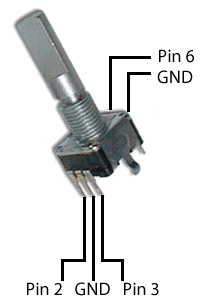

# Arduino platform
Before going through some use case using a set of sensors, ensure you have a development environment and the right board, we will consider the [Arduino Yun Board](https://www.arduino.cc/en/Main/ArduinoBoardYun)

## Prerequisite

### Arduino IDE
Before using your Arduino board, download the [Arduino IDE](https://www.arduino.cc/en/Main/Software), we suggest not to use the online version as you will not be able to test everything.
In the tool menu, ensure you select the Arduino board and also the right port.

### Getting started with your Arduino Yun
In order to get started with the Arduino Yun, we will use a simple example & code to check your environment is well setup.
In term of hardware for this section, you will need:
1. Your Arduino Yun connect to your computer using the USB cable provided in the box
2. one [Breadboard](https://learn.adafruit.com/lesson-0-getting-started/breadboard) which is used to easily play with all sensors without having to use a soldering iron. Also you will need [wire](https://www.adafruit.com/product/153)
3. a [Rotary Encoder](https://www.adafruit.com/product/377)

#### Physical setup
For breadboard use, simply bend back the metal flaps on each side so that the knob will sit flat in the breadboard. Otherwise, those metal flaps can be attached to a mounting surface for increased stability. Then connect it to the Ardhuino following this schema:

#### Sample code
Then load the [Rotary encoder sample code](./rotary_encoder/rotary_encoder.ino) in the Arduino IDE and download it to your Arduino.

Then once the program is running, on the Arduino IDE, open the serial monitor in order to see the output. If you turn the button, you should see the index value increasing/decreasing and if you push the button, it resets the index to 0